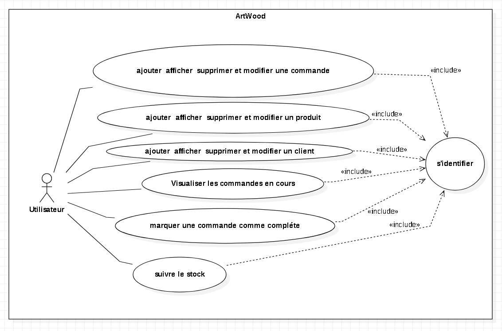
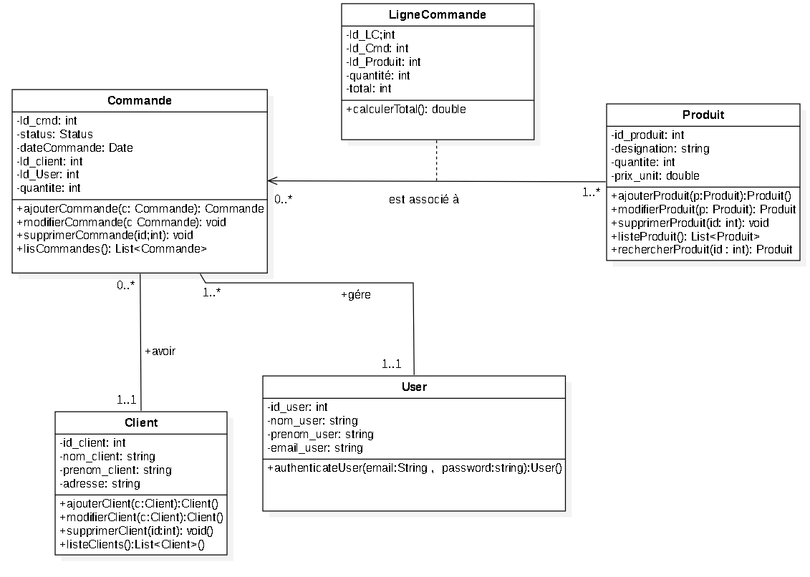

# ArtWood- Application de Gestion des Commandes d'ArtWood

## Description
OrderCraft est une application Java EE développée pour aider l'entreprise artisanale ArtWood à gérer efficacement ses commandes clients. L'application offre des fonctionnalités telles que l'ajout de commandes, la visualisation de l'état des commandes, la gestion des clients, le suivi des stocks, etc.

## Fonctionnalités

1. **Ajout de Commandes**
    - Les utilisateurs peuvent ajouter de nouvelles commandes en spécifiant les détails tels que le client, les articles commandés et la date de la commande.

2. **Visualisation des Commandes en Cours**
    - Une interface intuitive permet aux utilisateurs de voir l'état d'avancement des commandes en cours, y compris les détails spécifiques de chaque commande.

3. **Marquer les Commandes comme Complètes**
    - Les utilisateurs ont la possibilité de marquer les commandes comme complètes une fois qu'elles ont été traitées. Cela permet de suivre facilement les commandes encore en attente.

4. **Gestion des Clients**
    - Un module de gestion des clients permet aux utilisateurs de créer, afficher et mettre à jour les informations clients pour une gestion centralisée.

5. **Suivi des Stocks**
    - Intégration d'une fonctionnalité de suivi des stocks pour s'assurer que les articles nécessaires sont disponibles pour satisfaire les commandes.

## Diagrammes de Classes

## Stack Technique

- **Langage de Programmation:** Java
- **Frontend:** JSP, JSTL
- **Backend:** Servlets pour le traitement des requêtes HTTP
- **Gestion de Dépendances:** Apache Maven
- **Base de Données:** MySQL
- **Serveur d'Application:** Apache Tomcat
- **Logging:** Log4j pour la gestion des journaux

